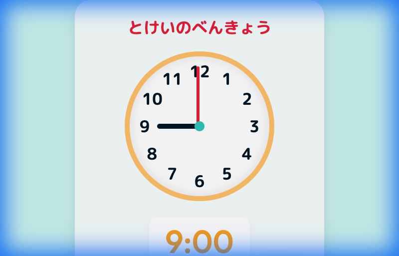
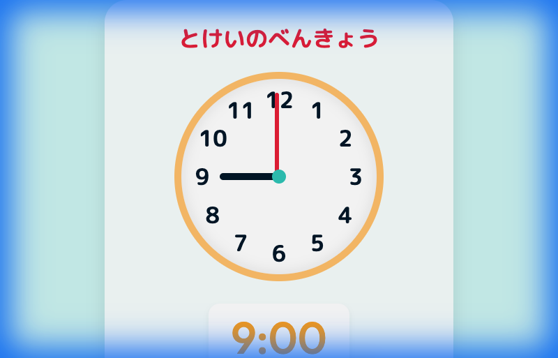

# Time Learning App for Kids / 子供向け時計学習アプリ

A fun and interactive web application designed to help children learn how to read an analog clock.
子供たちがアナログ時計の読み方を楽しく学べるWebアプリケーションです。

## Features / 機能

-   **Interactive Analog Clock**: Drag the hour and minute hands to set the time.
    -   **インタラクティブなアナログ時計**: 時計の針（時針・分針）をドラッグして自由に時間を動かせます。
-   **Real-time Digital Display**: The digital clock updates automatically as you move the hands.
    -   **デジタル時計との連動**: 針を動かすと、デジタル時計の表示もリアルタイムに更新されます。
-   **Quiz Mode**: Test your skills! "What time is it?"
    -   **クイズモード**: 「いまなんじ？」クイズで学習成果をテストできます。
-   **Scoring System**: Earn points for correct answers. Get 10 points for a celebration!
    -   **スコア機能**: 正解するとポイントゲット！10点取るとお祝いメッセージが表示されます。
-   **Kid-Friendly UI**: Bright colors, large fonts, and easy-to-read 5-minute markers.
    -   **子供向けデザイン**: 明るい色使い、大きな文字、読みやすい5分刻みの目盛りを採用しています。

## Screenshots / スクリーンショット

| Main View / メイン画面 | Quiz Mode / クイズモード |
|:---:|:---:|
|  |  |


## Tech Stack / 技術スタック

-   HTML5
-   CSS3 (Vanilla)
-   JavaScript (Vanilla)
-   Docker / Nginx (For Deployment)

## How to Run Locally / ローカルでの実行方法

### Using Docker / Dockerを使用する場合

```bash
# Build the image
docker build -t learning-app .

# Run the container
docker run -d -p 8080:8080 learning-app
```

Access `http://localhost:8080` in your browser.
ブラウザで `http://localhost:8080` にアクセスしてください。

### Without Docker / Dockerを使用しない場合

Simply open `index.html` in Google Chrome.
`index.html` をGoogle Chromeで開くだけで動作します。

## Deployment / デプロイ

This app is configured for deployment on **Google Cloud Run**.
このアプリは **Google Cloud Run** へのデプロイ用に構成されています。

```bash
gcloud run deploy learning-app --source . --allow-unauthenticated --region asia-northeast1
```

## License / ライセンス

This project is licensed under the MIT License - see the [LICENSE](LICENSE) file for details.
本プロジェクトはMITライセンスの下で公開されています。詳細は [LICENSE](LICENSE) ファイルを参照してください。

## Disclaimer / 免責事項

This application was created with the assistance of **Antigravity**, an AI coding assistant by Google DeepMind.
このアプリケーションは、Google DeepMindによって開発されたAIコーディングアシスタント **Antigravity** を利用して作成されました。

